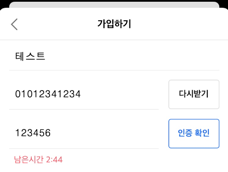

# 회원 관리 API
> 
> 해당 API는 Python 언어와 Django 프레임워크로 구현하였습니다.   

> ##### **가상환경은 /venv 아래 구성되어 있습니다.**


---
<br>

## 개발 범위
+ #### 사용자 정보
  > <br> 
  > 
  > ###### **논리명 - 필드명**
  > + 아이디 - username
  > + 비밀번호 - password
  > + 닉네임 - nickname
  > + 이메일 - email
  > + 전화번호 - phone
  > + 이름(이름) - first_name
  > + 성(이름) - last_name
  > 
  > <br>
  
<br>

+ #### 다음과 같은 기능이 구현되었습니다.  
  > <br>
  > 
  > **회원 가입 기능**
  > + 인증번호로 인증이 된 전화번호로만 3분 이내 회원가입이 가능 합니다.
  > <br>
  > <br>
  > 
  
  > 
  ><br>
  > 
  > **로그인 기능**
  > + 로그인 시도를 한 사용자의 정보가 일치한다면 JWT 토큰을 발행하여 로그인이 가능합니다.
  > + 사용자는 아래와 같은 조합으로 로그인이 가능합니다.
  >   + **(아이디 + 비밀번호)**, **(이메일 + 비밀번호)**
  > <br>
  > <br>
  > 

  > 
  ><br>
  >      
  > **내 정보 보기 기능**
  > + JWT Access Token을 검사하여 로그인된 사용자에 한해 나의 정보를 JSON형식으로 응답 받습니다.
  > <br>
  > <br>
  > 
   
  > 
  ><br>
  > 
  > **비밀번호 찾기 (재설정) 기능**
  > + 로그인이 되어 있지 않은 상태에서 인증 후 비밀번호 재설정이 가능합니다.  
  > + 비밀번호 찾기 요청은 로그인과 동일하게 아래와 같은 조합으로 가능합니다.  
  >   + **(아이디 + 비밀번호)**, **(이메일 + 비밀번호)**
  > + 재설정은 아래 순서로 진행합니다.  
  >   + 비밀번호 찾기 요청 &rarr; 토큰발급 응답 &rarr; 재설정 요청 &rarr; 토큰 확인, 비밀번호 변경 응답
  > <br>
  > <br>
  >
 <br> 

+ #### 추가 사항  
  > <br>
  > 
  > **아이디 찾기 기능**
  > + 전화번호 인증 후 아이디 찾기가 가능합니다.
  > <br>
  > <br>
  > 
<br>

---
<br>

## 프로젝트 구조
+ ### /project-structure.txt
  >   <br>
  > 
  >   <br>
  >
  > <br>

<br>

---

## 실행 방법 
_.zip파일 압축해제 후 실행할 경우, 바로 **[서버 실행]** 을 진행하면 됩니다._
+ ### **라이브러리 패키지 설치**  

  아래 명령어로 실행에 필요한 Django 라이브러리를 설치합니다.
  ```sh
  $ pip install -r requirements.txt 
  ```

+ ### **Migrations**  

  아래 명령어로 실행에 필요한 migration작업을 진행합니다.
  ```sh
  $ python management.py makemigraions
  $ python management.py migrate
  ```
+ ### **초기 데이터 로드**

  아래 명령어으로 초기 데이터를 로드합니다.
  ```sh
  $ ./manage.py loaddata db.json
    ```
+ ## **서버 실행**

  아래 명령어으로 서비스를 실행합니다.
  ```sh
  $ python manage.py runserver
  ```
+ ### **테스트 코드 실행**  
  아래 명령어으로 단위 테스트 실행과 그 결과를 확인합니다.  
  ```sh
  $ coverage run manage.py test
  $ coverage report
  ```
  _테스트 코드만 실행할 경우 `$ python manage.py test` 를 입력하면 됩니다._

  <br>

---
<br>

## 사용 기술
+ ### **프로그래밍 언어 & 프레임워크 & DBMS**
  > <br>
  > 
  > + Python  
  > + Django  
  > + SQLite  
  > <br>

+ ### **주요 라이브러리**
  > <br>
  > 
  > + djangorestframework  
  > + djangorestframework-simplejwt  
  > + drf-yasg  
  > <br>

<br>

---

<br>

## 구현 스펙
+ ### **API List** 
  > <br>  
  > 
  > ## _**아래 링크에서 API 상세 명세를 확인해주세요**_  
  > 
  > ### **링크 : [API 상세 명세서](https://docs.google.com/spreadsheets/d/1Yf6sZEcbC5SDvAkzwslV0VDprxMRaxjBAUx4FSREYuE/edit?usp=sharing)**  
  > <br>  
  >  
  <br>  

  |       | **Method** |            **URI**             | **Sign-in <br/>Required** | Description         |
  |:-----:|:------------------------------:|--------------------------------|:-------------------------:|---------------------|
  |   1   |    POST    |   /accounts/check-if-exists    |             N             | 중복체크 / 가입된 유저인지 확인  |
  |   2   |    POST    | /accounts/authentication-code  |             N             | 인증코드 발송             |
  |   3   |    POST    | /accounts/authenticate-by-code |             N             | 인증코드 검증             |
  |   4   |    POST    |       /accounts/sign-up        |             N             | 회원가입                |
  |   5   |    POST    |      /accounts/sign-in/id      |             N             | ID(username)으로 로그인  |
  |   6   |    POST    |    /accounts/sign-in/email     |             N             | email으로 로그인         |
  | ~~7~~ |  ~~POST~~  |  ~~/accounts/sign-in/phone~~   |           ~~N~~           | ~~전화번호로 로그인~~       |
  |   8   |    GET     |    /accounts/my-information    |             Y             | 나의 정보 보기            |
  |   9   |    POST    |    /accounts/find-password     |             N             | 비밀번호 찾기 요청          |
  |  10   |    POST    |   /accounts/change-password    |             N             | 비밀번호 변경             |
  |  11   |    POST    |           /api/token           |             N             | JWT 인증토큰 발급         |
  |  12   |    POST    |       /api/token/refresh       |             N             | JWT 인증 Access토큰 재발급 |
  |  13   |    POST    |    /accounts/find-username     |             N             | 아이디 찾기              |

<br>

+ ### **기능별 Frontend 예상 로직**
  > <br>
  > 
  > ### **회원 가입 기능**
  > + 회원가입 예상 Form  
  > _(두 화면은 같은 Form이며, 스크롤을 내렸을 때의 화면입니다.)_  
  >    <br> 
  >
  > + URI 호출 순서 ***( 경로 : /accounts )***
  >   + ***( /check-if-exists )*** &rarr; ***( /authentication-code )*** &rarr; ***( /authenticate-by-code )*** &rarr; ***( /sign-up )***  
  > <br>  
  > 
  > 1. 사용자 정보를 입력하고 **인증번호** 버튼을 클릭하여 **[인증코드 API]** 를 호출합니다.  
  > 2. 코드 발송에 성공하면 **인증확인** 버튼으로 **[인증코드 검증 API]** 를 요청을 합니다.  
  > 3. 인증확인이 완료되면 **가입하기** 버튼을 활성화 하여 **[회원가입 API]** 를 호출합니다.  
  > <br>
  > 
  > > _사용자 정보 각 필드별 중복체크가 필요한 경우 **[중복체크 API]** 를 호출합니다.    
  > > **[인증코드 API]** 호출 시 **allowed_auth_types** 의 값은 **sign-up** 이어야 합니다._  
  >
  > <br>
  
  <br>

  > <br>
  >
  > ### **로그인 기능**
  > + 로그인 예상 Form  
  >   <br> 
  > 
  > + URI 호출 순서 ***( 경로 : /accounts )***
  >   + ***( /sign-in/id )*** 또는 ***( /sign-in/email )***  
  > <br>  
  > 
  > 1. 사용자는 원하는 로그인 방식을 선택하여 해당 Form으로 진입합니다.  
  > 2. 사용자의 로그인 정보를 입력한 후 **로그인** 버튼으로 **[로그인 API]** 를 호출합니다.  
  > 3. 로그인에 성공한다면 서버로부터 **Access Token**과 **Refresh Token**을 응답받습니다.  
  > 4. 로그인을 유지하기 위해서는 매 30분마다 **[JWT 인증토큰 발급 API]** 를 호출하여 Access Token을 갱신해야합니다.
  >  <br>  
  >  
  > > _**로그인 방식** 은 **아이디** 와 **이메일** 방식이 있으므로 방식에 맞는 URI를 호출하여야 합니다._
  >  
  ><br>

  <br>
  
  > <br>
  >
  > ### **비밀번호 찾기 (재설정) 기능**
  > + 비밀번호 찾기 (재설정) 예상 Form 
  >   <br>
  >    <br>
  > <br>  
  > 
  > + URI 호출 순서 ***( 경로 : /accounts )***  
  >   + ***( /authentication-code )*** &rarr; ***( /authenticate-by-code )*** &rarr; ***( /find-password )***	&rarr; ***( /change-password )***  
  > <br>  
  > 
  > 1. 사용자는 원하는 비밀번호 찾기 방식을 선택하여 해당 Form으로 진입합니다.  
  > 2. 사용자의 정보를 입력한 후 **인증번호** 버튼을 클릭하여 **[인증코드 API]** 를 호출합니다.
  > 3. 코드 발송에 성공하면 **인증확인** 버튼으로 **[인증코드 검증 API]** 를 요청을 합니다.
  > 4. 인증확인이 완료되면 **확인** 버튼으로 **[비밀번호 찾기 요청 API]** 를 호출하며 두 번째 Form으로 이동합니다.  
  > 5. 해당 화면에서 새로운 비밀번호를 입력한 뒤 **확인** 버튼으로 **[비밀번호 변경 API]** 를 호출합니다.   
  > <br>
  > 
  > > _
  > > 3번 단계에서 인증이 완료되면 서버에서 토큰을 발행합니다.  
  > > 이 토큰은 payload에 user의 key값은 없으며, **{nickname}_password_change** 형식의 데이터가 담겨있습니다.
  > > 두 번째 Form에서 새로운 요청인 **[비밀번호 변경 API]** 단계에서 동일한 유저가 접근한게 맞는지 검증하기 위함 입니다._  <br>  
  > > _**[인증코드 API]** 호출 시 **allowed_auth_types**의 값은 **sign-up**이어야 합니다._  
  >  <br>  

  <br>

  > <br>
  >
  > ### **아이디 찾기 기능**
  > + 아이디 찾기 예상 Form   
  >     
  > <br>  
  > 
  > + URI 호출 순서 ***( 경로 : /accounts )***
  >   + ***( /authentication-code )*** &rarr; ***( /authenticate-by-code )*** &rarr; ***( /find-username )***  
  > <br>  
  > 
  > 1. 사용자의 전화번호를 입력한 후 **인증번호** 버튼을 클릭하여 **[인증코드 API]** 를 호출합니다.  
  > 2. 코드 발송에 성공하면 **인증확인** 버튼으로 **[인증코드 검증 API]** 를 요청을 합니다.  
  > 3. 인증확인이 완료되면 **확인** 버튼으로 두 번째 화면으로 이동하여 아이디 찾기 결과를 확인합니다.  
  > <br>
  > 
  > > 
  > > _**[전화번호로 로그인 API]** 를 대체하기 위해 개발한 API입니다._
  > >   
  >  <br>  

  <br>
  
  > <br>
  >  
  > ### 내 정보 보기 기능  
  > + 내 정보 보기 예상 Form  
  >   <br>
  > <br>  
  > 
  > + URI 호출 순서 ***( 경로 : /accounts )***  
  >   + ***( /my-information )***  
  > <br>  
  > 
  > 1. 위와 같은 화면에서 활용 가능합니다.  
  > 2. 로그인된 상태로 Request Header에 Access Token을 담아 **[나의 정보 보기 API]** 를 호출합니다.  
  > 3. JWT 토큰이 유효하면 나의 정보를 JSON형식으로 응답 받습니다.  
  > <br>  

<br>


---
<br>

# 프로젝트 강조 사항

+ ### **JWT Token**
  > ### **Custom Token Claims**
  > + 토큰이 탈취되어도 **username, email** 처럼 로그인에 직접 사용가능한 정보는 유출되지 않기위해 커스텀하였습니다.
  > + 토큰 Claim을 커스텀하여 사용자의 **nickname**을 응답값으로 전달해줍니다.
  > + Frontend에서는 **nickname**으로 유저를 식별 가능합니다.  
  > + JWT는 decode가 가능하며 payload 내용을 확인할 수 있습니다.
  > + _**때문에, 핵심정보는 담지 않으면서도 Frontend에서 사용자 정보와 관련된 작업을 할 수 있도록 구현했습니다.**_
  > 
  > ### **Unauthenticated Token Obtain Serializer**
  > + **로그인되지 않은 사용자**를 위한 토큰을 발행합니다.
  > + 토큰 Claim을 커스텀하여 사용자의 **{nickname}** **+** **{_사용용도}** 로 식별 가능합니다.
  >   + Ex) nickname이 "django"인 유저는 "django_password_change"을 응답받습니다.
  > + 비밀번호 찾기 요청을 하고 다음 Form으로 넘어갔을 때, 해당 사용자는 인증번호로 인증을 한 상태입니다.
  > + _**그러나, 두 번째 Form(비밀번호 재설정) 단계에서 인증번호를 완료한 다른 유저의 ID로 비밀번호 변경을 요청할 위험이 있기 때문에 한번 더 검증하기 위해 추가하였습니다.**_
  >
  > <br>
  
  <br>

  + ### **TDD개발**  
  >   ### **TDD**  
  >   + 일부 로직의 초기 세팅을 제외하고는 Test코드를 먼저 작성하여 TDD를 목표로 개발하였습니다.  
  >   + **coverage** 라이브러리의 **report** 기능을 활용하여 지속적으로 테스트 수행 범위를 체크하였습니다.  
  >   + 현재 **coverage** 수준은 아래와 같습니다.  
  >     + #### /accountapp/views.py : ***95%***  
  >     + #### TOTAL : ***95%***  
  >
  >     
  >   + 마무리 작업에는 놓친 오류를 찾고 완성도를 높이고자 아래와 같이 **[To-Do]** 를 작성하여 진행했습니다. 
  > <br>
  >     
  > <br>
  > 
    

+ ### **API 문서화**
  > ### **Swagger**
  > + drf-yasg 라이브러리를 적용하여 **Swagger Framework** 기반 API 문서화를 구현하였습니다.
  > + **URI**
  >   + /swagger
  >   + /redoc
  > ### **Google Docs - SpreadSheet 링크**  &rarr;  **[API 상세 명세서](https://docs.google.com/spreadsheets/d/1Yf6sZEcbC5SDvAkzwslV0VDprxMRaxjBAUx4FSREYuE/edit?usp=sharing)**  
  > + 협업에 용이하도록 쉽게 배포할 수 있는 **Google Docs**에 API 상세 명세서를 작성하였습니다.
  > 
  > <br>
    
  <br>

+ ### **그 외**
  > ### **Timeout**
  > + 인증번호 입력(3분), 로그인시(5분) 타임아웃을 설정했습니다.
  > + 시간은 **views.py**에서 **Timeout** 변수로 간단하게 세팅 가능합니다.  
  > ### **식별가능한 정보**  
  > + 전화번호도 사용자를 식별할 수 있는 정보에 속하지만, ID와 Email을 모두 잊어버린 사용자는 드물다고 판단하였습니다.  
  > + 따라서, **[전화번호로 로그인 API]** 는 구현하였지만 배포하지 않습니다.  
  > + 전화번호를 통해 로그인이 필요한 사용자는 **[아이디 찾기 API]** 를 이용할 수 있습니다.  
  > ### **Custom Exception handler**  
  > + Exception Handler 를 커스텀 하여 예상치 못한 Exception 에 응답이 가능하도록 구현하였습니다.  
  > + 404, 500 Error 또한 Views로 구현하여 settings.DEBUG = False 일 때 에러 메시지를 리턴합니다.
  > + Frontend와 데이터 통신시 발생할 수 있는 KeyError, AttributeError를 예외처리 해줍니다.
  > 
  > <br>
  
  >
  >
  > ### **앞으로 서비스의 개선 여지**
  > + .env와 같은 환경변수 파일을 따로 관리하여 보안 위협이 있는 KEY 노출을 방지할 수 있습니다.
  > + APIException 커스텀 및 로깅
  > + JWT Blacklist 구현하여 보안을 강화합니다.
  > + Frontend에서 요청시 인코딩된 Password를 전송하고, Backend에서는 이를 디코딩하여 사용합니다.
  >   + Backend에서 관리되는 Key와는 다른 Key를 사용해야합니다.
  > 
  > <br>

<br>
